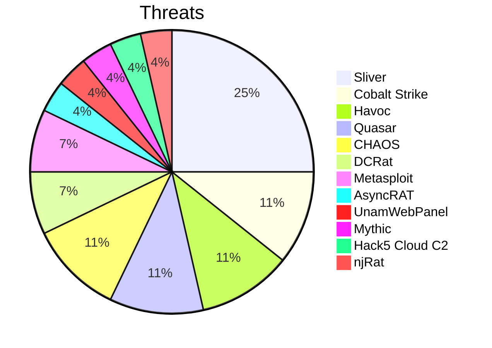
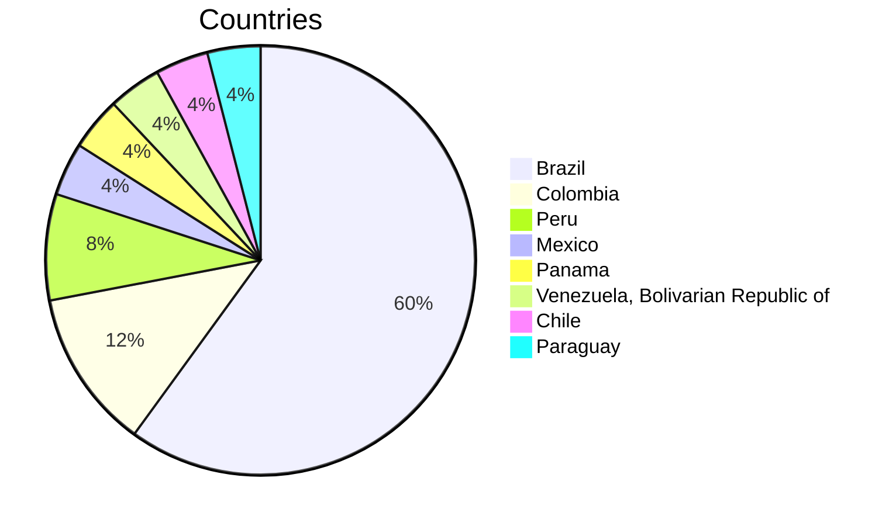
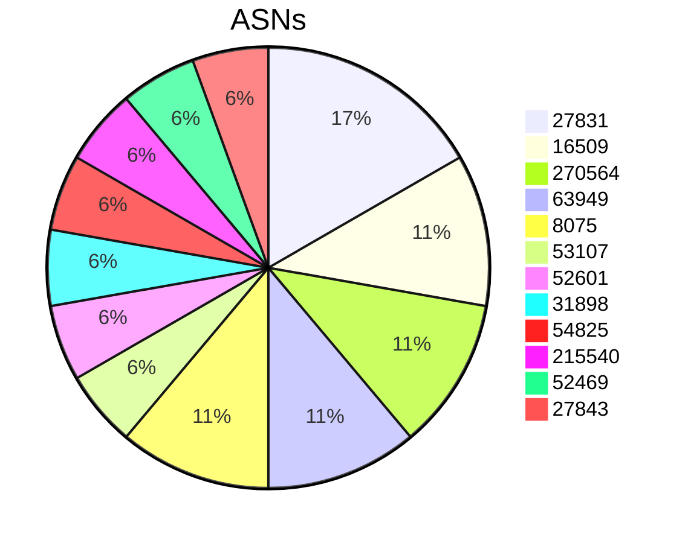
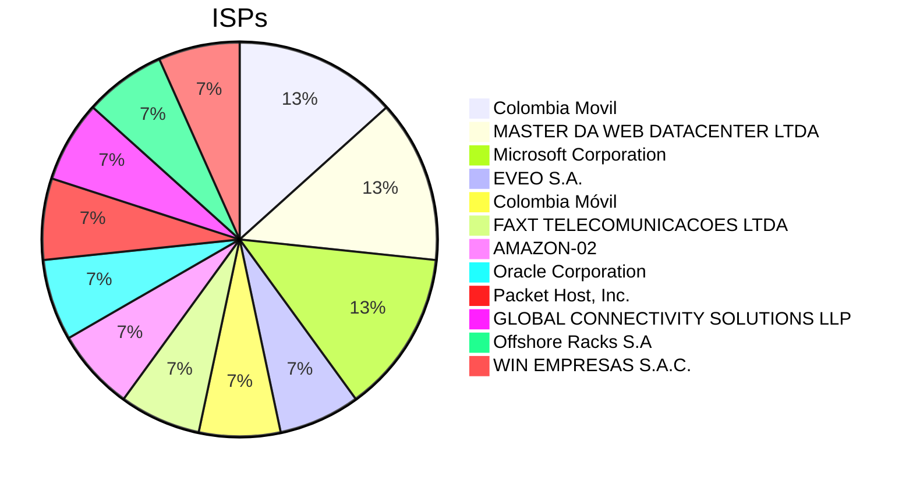
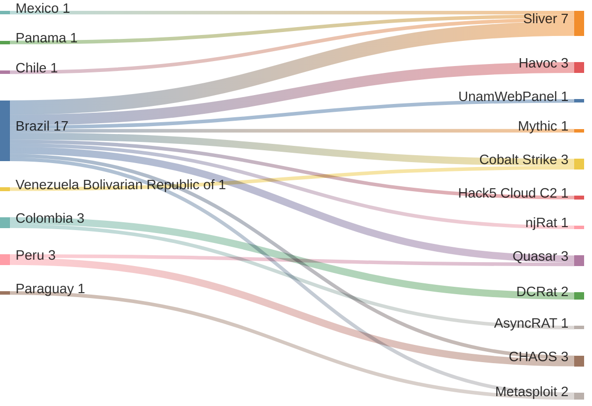
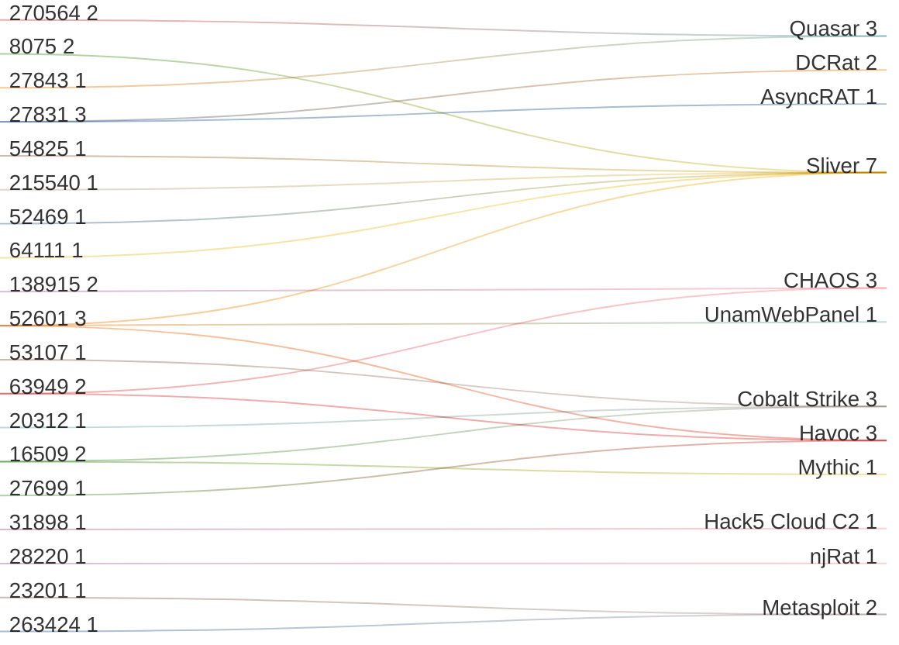
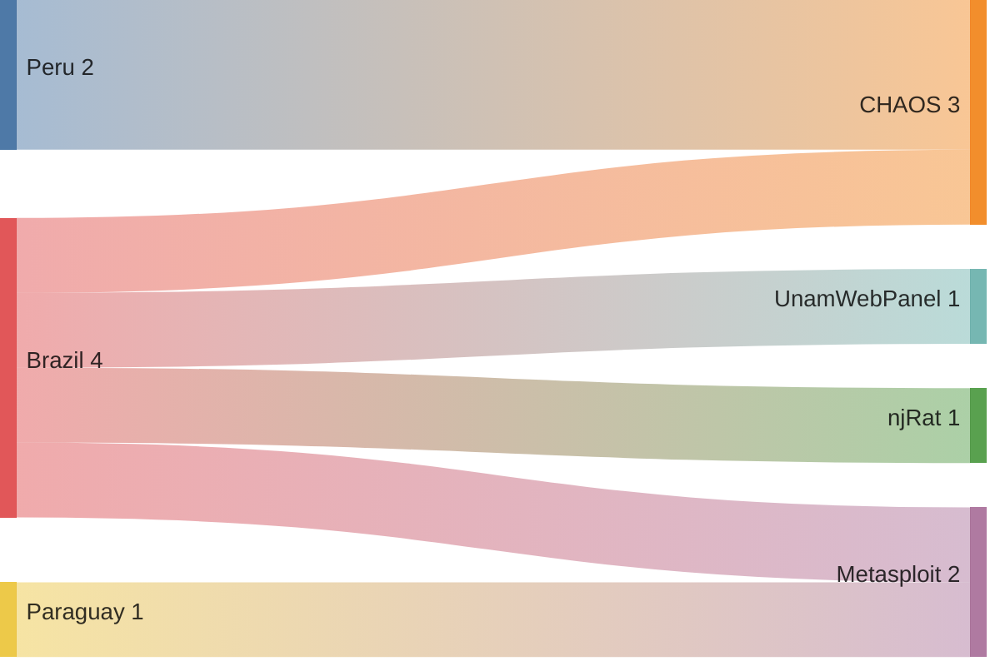
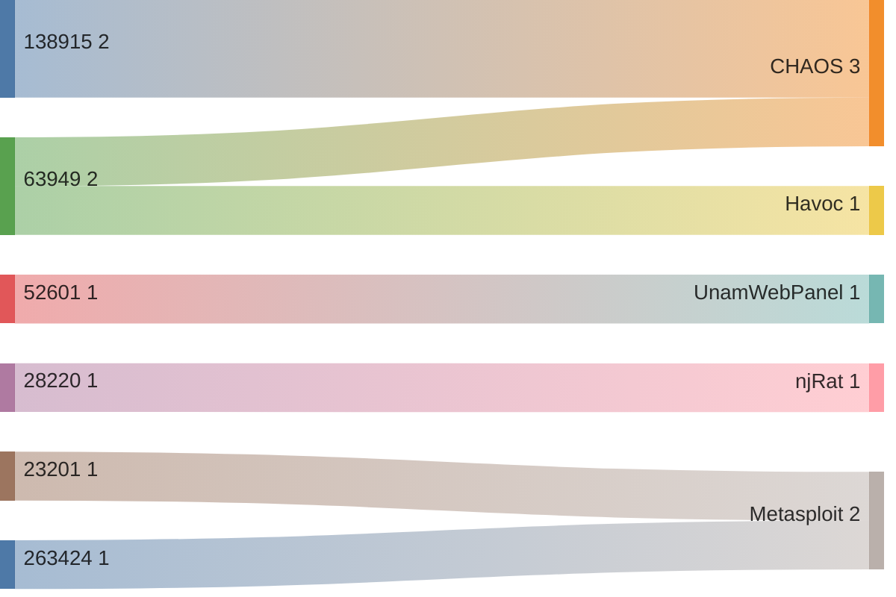

# ZoqueLabs • LATAM Threat-Infra Snapshot

> low-noise telemetry, high-signal threats — humble hacker edition

- Generated: `2026-01-10T00:39:00Z`
- Current snapshot: **REPLACE_ME_WITH_CURRENT_SNAPSHOT_LINK**

## Metrics (current)

- **IPs:** `25` | **Unique ports:** `17` | **Threat frameworks:** `12` | **Countries:** `8` | **Cities:** `11` | **ASNs:** `19`

## Tops (current)

- Threats: `Sliver(7)` `Cobalt Strike(3)` `Havoc(3)` `Quasar(3)` `CHAOS(3)` `DCRat(2)` `Metasploit(2)` `AsyncRAT(1)` `UnamWebPanel(1)` `Mythic(1)` `Hack5 Cloud C2(1)` `njRat(1)`
- Countries: `Brazil(15)` `Colombia(3)` `Peru(2)` `Mexico(1)` `Panama(1)` `Venezuela, Bolivarian Republic of(1)` `Chile(1)` `Paraguay(1)`
- Cities: `São Paulo(10)` `Barranquilla(3)` `Belo Horizonte(3)` `Lima(2)` `La Cañada(1)` `Panamá(1)` `Barquisimeto(1)` `Santiago(1)` `Natal(1)` `Limpio(1)` `Varginha(1)`
- ASNs: `27831(3)` `16509(2)` `270564(2)` `63949(2)` `8075(2)` `53107(1)` `52601(1)` `31898(1)` `54825(1)` `215540(1)` `52469(1)` `27843(1)`
- ISPs: `Colombia Movil(2)` `MASTER DA WEB DATACENTER LTDA(2)` `Microsoft Corporation(2)` `EVEO S.A.(1)` `Colombia Móvil(1)` `FAXT TELECOMUNICACOES LTDA(1)` `AMAZON-02(1)` `Oracle Corporation(1)` `Packet Host, Inc.(1)` `GLOBAL CONNECTIVITY SOLUTIONS LLP(1)` `Offshore Racks S.A(1)` `WIN EMPRESAS S.A.C.(1)`
- Orgs: `unknown(8)` `Microsoft Corporation(2)` `Colombia Móvil(1)` `FAXT TELECOMUNICACOES LTDA(1)` `Oracle Public Cloud(1)` `Equinix Services, Inc.(1)` `GLOBAL CONNECTIVITY SOLUTIONS LLP(1)` `Offshore Racks S.A(1)` `Fundación Centro Nacional de Innovación Tecnológica (CENIT)(1)` `Amazon Data Services Brazil(1)` `TELEFÔNICA BRASIL S.A(1)` `INFORMATICA BLUEHOSTING LIMITADA(1)`
- Ports (frequency across IPs): `31337(7)` `443(3)` `8080(2)` `1080(2)` `3790(2)` `8848(1)` `1000(1)` `10035(1)` `9000(1)` `11180(1)` `9999(1)` `80(1)`

## Graphs (current)

### Country → Threat (top)

### ASN → Threat (top)

## Delta vs previous snapshot

- IPs: **+8** / **-0** (persistent: `17`)
- Threat frameworks: **+4** / **-0**
- Countries: **+1** / **-0**
- ASNs: **+5** / **-0**
- ISPs: **+6** / **-0**
- Orgs: **+6** / **-0**
- Ports: **+6** / **-0**
- Cities: **+3** / **-1**

### Delta lists (compact)

- New IPs: `156.244.39.44`, `170.231.155.101`, `172.233.1.83`, `172.233.27.101`, `177.89.234.43`, `179.0.178.198`, `186.17.213.66`, `4.201.155.137`
- Removed IPs: _none_
- New threats: `CHAOS`, `Metasploit`, `UnamWebPanel`, `njRat`
- Removed threats: _none_
- New countries: `Paraguay`
- New ASNs: `138915`, `23201`, `263424`, `28220`, `63949`
- New ISPs: `AKAMAI-LINODE-AP Akamai Connected Cloud`, `Akamai Connected Cloud`, `Alares Cabo Servicos de Telecomunicacoes S.A.`, `Fonelight Telecomunicações S/A`, `Kaopu Cloud HK Limited`, `Telecel S.A.`
- New ports: `11180`, `11434`, `1167`, `1177`, `1604`, `3790`

### IP reuse / threat drift

- IPs with threat changes: `1`
  - `177.124.72.24`: ['Havoc', 'Sliver'] → ['Havoc', 'Sliver', 'UnamWebPanel'] (+['UnamWebPanel'], -[])

### Delta graph: NEW Country → Threat edges

### Delta graph: NEW ASN → Threat edges

## All IPs (current snapshot)

| IP | Threats | Ports | Country | City | ASN | ISP | Org | Source | Last scan |
|---|---|---|---|---|---|---|---|---|---|
| 147.28.223.190 | Sliver | 31337 | Mexico | La Cañada | AS54825 | Packet Host, Inc. | Equinix Services, Inc. | shodan | 2026-01-04_18-32-22 |
| 147.45.116.18 | Sliver | 31337 | Brazil | São Paulo | AS215540 | GLOBAL CONNECTIVITY SOLUTIONS LLP | GLOBAL CONNECTIVITY SOLUTIONS LLP | shodan | 2026-01-09_23-32-34 |
| 15.228.3.86 | Cobalt Strike | 80 | Brazil | São Paulo | AS16509 | Amazon.com, Inc. | Amazon Data Services Brazil | shodan | 2026-01-06_03-05-38 |
| 150.187.25.242 | Cobalt Strike | 9999 | Venezuela, Bolivarian Republic of | Barquisimeto | AS20312 | Fundación Centro Nacional de Innovación Tecnológica (CENIT) | Fundación Centro Nacional de Innovación Tecnológica (CENIT) | shodan | 2026-01-09_06-05-58 |
| 152.67.58.223 | Hack5 Cloud C2 | 8080 | Brazil | São Paulo | AS31898 | Oracle Corporation | Oracle Public Cloud | shodan | 2026-01-09_21-42-33 |
| 156.244.39.44 | CHAOS;CHAOS | 1604;11434 | Peru | Lima | AS138915 | Kaopu Cloud HK Limited | Lightnode Limited | shodan | 2026-01-09_17-34-42 |
| 161.132.220.65 | Quasar | 8080 | Peru | Lima | AS27843 | WIN EMPRESAS S.A.C. | unknown | censys | 2026-01-09_12-14-17 |
| 170.231.155.101 | Metasploit | 3790 | Brazil | Varginha | AS263424 | Fonelight Telecomunicações S/A | Fonelight Telecomunicações S/A | shodan | 2025-12-26_00-53-40 |
| 172.233.1.83 | Havoc | 443 | Brazil | São Paulo | AS63949 | AKAMAI-LINODE-AP Akamai Connected Cloud | unknown | censys | 2026-01-09_16-14-23 |
| 172.233.27.101 | CHAOS | 1167 | Brazil | São Paulo | AS63949 | Akamai Connected Cloud | Linode | shodan | 2025-12-28_05-50-23 |
| 177.124.72.24 | Sliver;Havoc;UnamWebPanel | 31337;443;11180 | Brazil | Belo Horizonte | AS52601 | FAXT TELECOMUNICACOES LTDA | FAXT TELECOMUNICACOES LTDA | shodan | 2026-01-09_23-18-10 |
| 177.136.225.181 | Cobalt Strike | 10035 | Brazil | São Paulo | AS53107 | EVEO S.A. | unknown | censys | 2026-01-09_21-10-21 |
| 177.89.234.43 | njRat | 1177 | Brazil | Natal | AS28220 | Alares Cabo Servicos de Telecomunicacoes S.A. | CABO SERVICOS DE TELECOMUNICACOES LTDA | shodan | 2026-01-06_01-39-45 |
| 179.0.178.198 | Quasar | 1080 | Brazil | Belo Horizonte | AS270564 | MASTER DA WEB DATACENTER LTDA | unknown | censys | 2026-01-09_02-17-04 |
| 179.0.178.79 | Quasar | 1080 | Brazil | Belo Horizonte | AS270564 | MASTER DA WEB DATACENTER LTDA | unknown | censys | 2026-01-02_19-13-48 |
| 181.174.164.116 | Sliver | 31337 | Panama | Panamá | AS52469 | Offshore Racks S.A | Offshore Racks S.A | shodan | 2026-01-09_23-13-34 |
| 181.206.158.190 | DCRat | 1000 | Colombia | Barranquilla | AS27831 | Colombia Movil | unknown | censys | 2026-01-02_16-17-48 |
| 186.17.213.66 | Metasploit | 3790 | Paraguay | Limpio | AS23201 | Telecel S.A. | Telecel S.A. | shodan | 2026-01-09_20-41-22 |
| 191.93.113.160 | DCRat | 8848 | Colombia | Barranquilla | AS27831 | Colombia Movil | unknown | censys | 2026-01-05_18-30-31 |
| 191.93.118.254 | AsyncRAT | 9000 | Colombia | Barranquilla | AS27831 | Colombia Móvil | Colombia Móvil | shodan | 2026-01-09_19-44-26 |
| 201.92.133.149 | Havoc | 8081 | Brazil | São Paulo | AS27699 | TELEFÔNICA BRASIL S.A | TELEFÔNICA BRASIL S.A | shodan | 2025-12-22_01-54-38 |
| 4.201.155.137 | Sliver | 31337 | Brazil | São Paulo | AS8075 | Microsoft Corporation | Microsoft Corporation | shodan | 2026-01-09_23-17-46 |
| 4.201.185.160 | Sliver | 31337 | Brazil | São Paulo | AS8075 | Microsoft Corporation | Microsoft Corporation | shodan | 2025-12-16_11-49-04 |
| 45.236.130.44 | Sliver | 31337 | Chile | Santiago | AS64111 | INFORMATICA BLUEHOSTING LIMITADA | INFORMATICA BLUEHOSTING LIMITADA | shodan | 2025-12-15_14-32-17 |
| 54.232.144.183 | Mythic | 443 | Brazil | São Paulo | AS16509 | AMAZON-02 | unknown | censys | 2026-01-05_13-13-54 |

---

**Current snapshot link:** REPLACE_ME_WITH_CURRENT_SNAPSHOT_LINK
