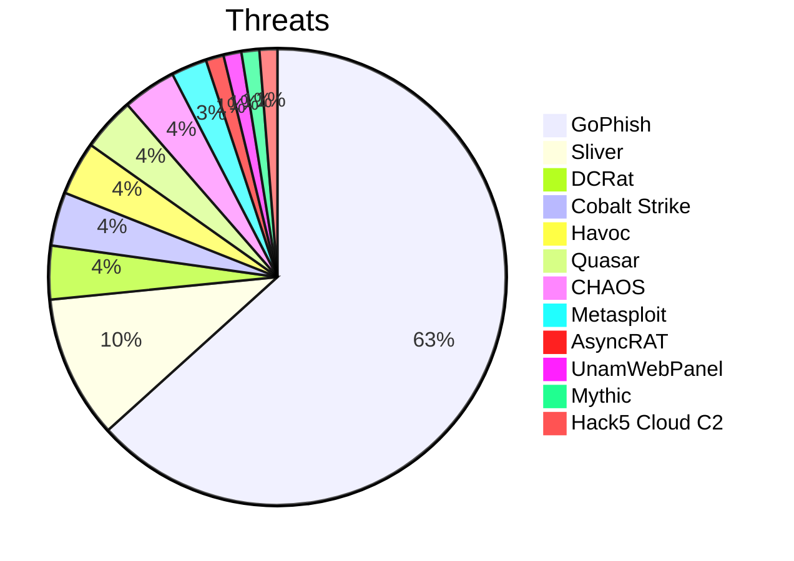
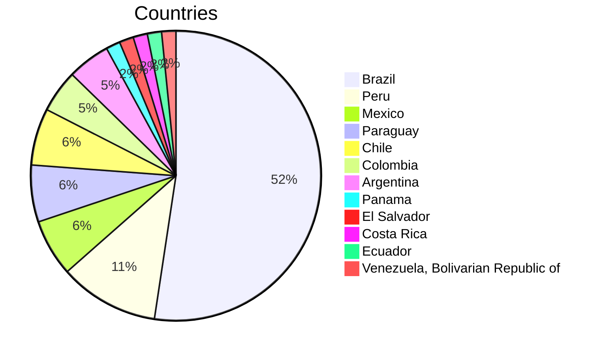
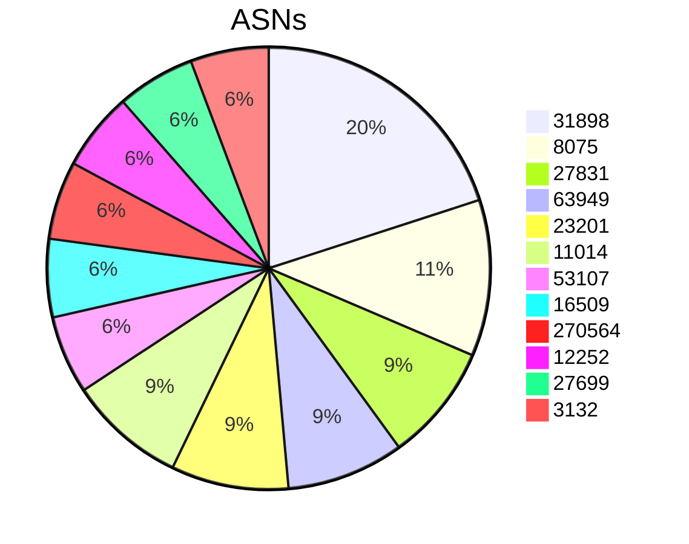
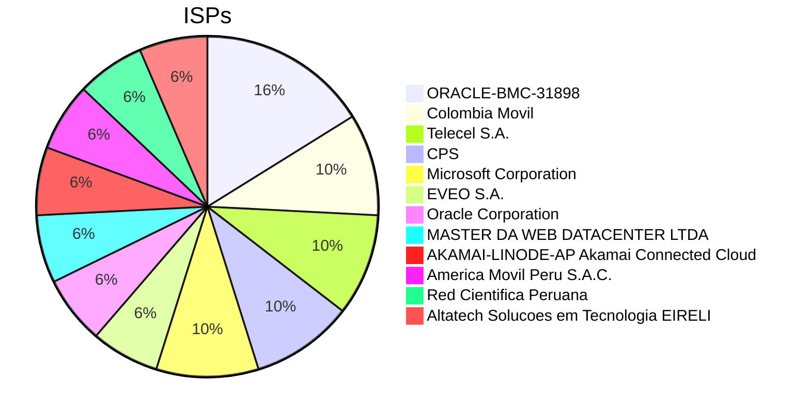
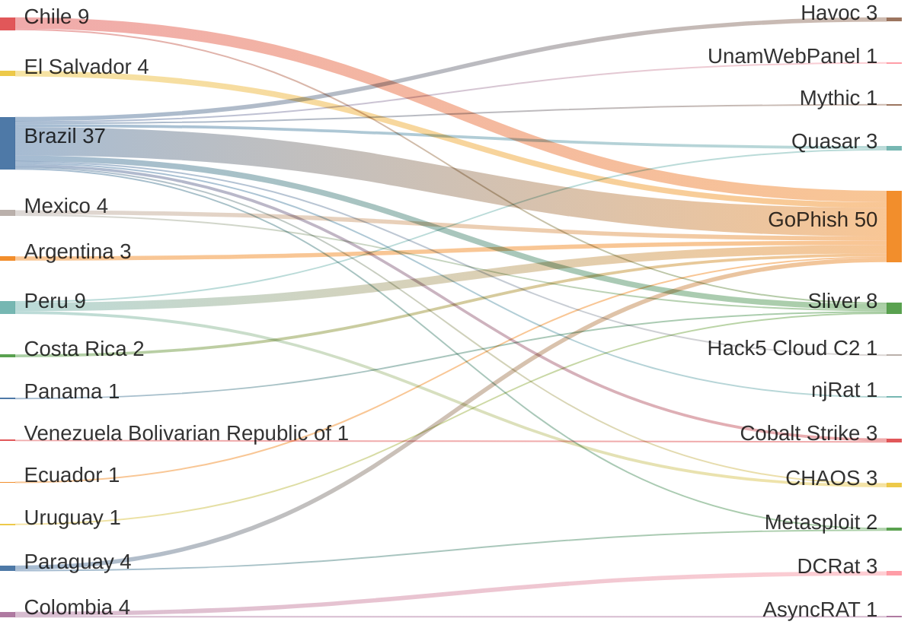
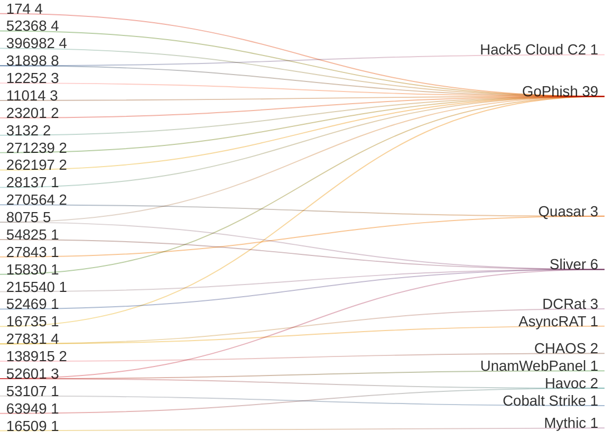
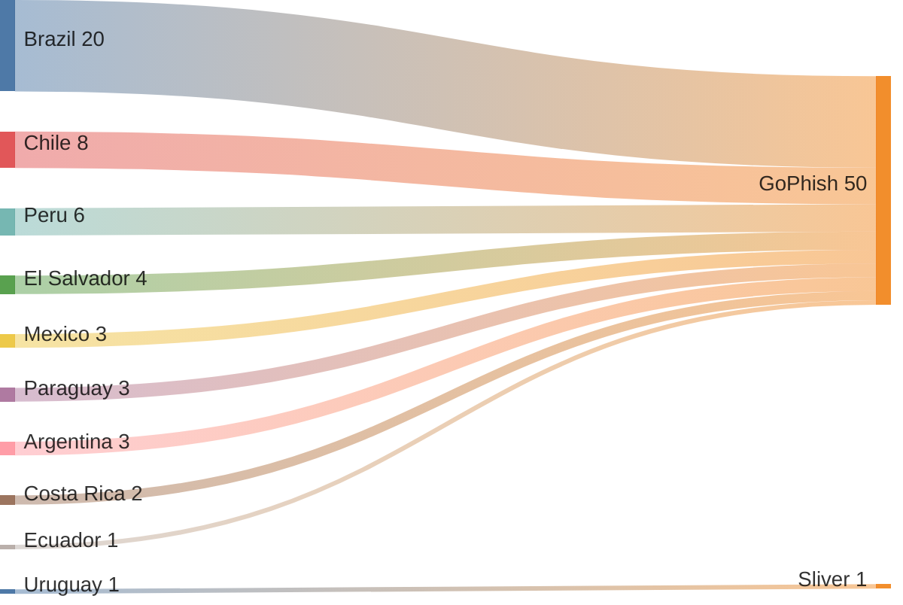
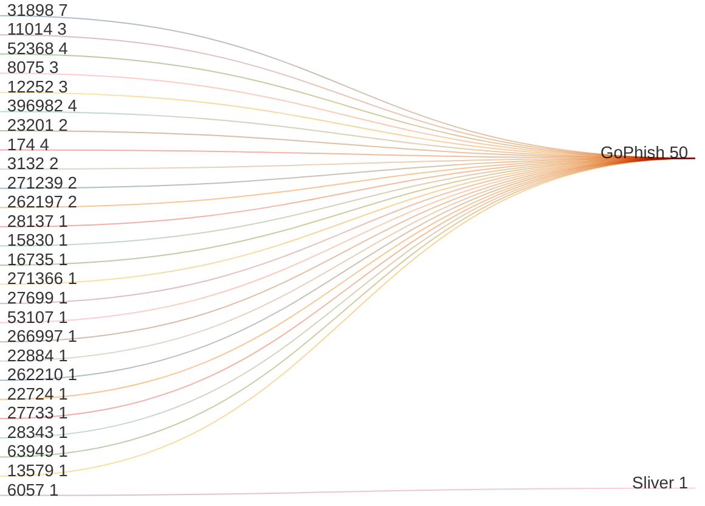

# ZoqueLabs • LATAM Threat-Infra Snapshot

> low-noise telemetry, high-signal threats — humble hacker edition

- Generated: `2026-01-13T14:44:12Z`
- Current snapshot: **REPLACE_ME_WITH_CURRENT_SNAPSHOT_LINK**

## Metrics (current)

- **IPs:** `64` | **Unique ports:** `21` | **Threat frameworks:** `13` | **Countries:** `13` | **Cities:** `27` | **ASNs:** `39`

## Tops (current)

- Threats: `GoPhish(50)` `Sliver(8)` `DCRat(3)` `Cobalt Strike(3)` `Havoc(3)` `Quasar(3)` `CHAOS(3)` `Metasploit(2)` `AsyncRAT(1)` `UnamWebPanel(1)` `Mythic(1)` `Hack5 Cloud C2(1)`
- Countries: `Brazil(33)` `Peru(7)` `Mexico(4)` `Paraguay(4)` `Chile(4)` `Colombia(3)` `Argentina(3)` `Panama(1)` `El Salvador(1)` `Costa Rica(1)` `Ecuador(1)` `Venezuela, Bolivarian Republic of(1)`
- Cities: `São Paulo(21)` `Lima(7)` `Santiago(4)` `Barranquilla(3)` `Belo Horizonte(3)` `Buenos Aires(3)` `Asunción(2)` `Rolândia(2)` `La Cañada(1)` `Panamá(1)` `Triana(1)` `Rio de Janeiro(1)`
- ASNs: `31898(7)` `8075(4)` `27831(3)` `63949(3)` `23201(3)` `11014(3)` `53107(2)` `16509(2)` `270564(2)` `12252(2)` `27699(2)` `3132(2)`
- ISPs: `ORACLE-BMC-31898(5)` `Colombia Movil(3)` `Telecel S.A.(3)` `CPS(3)` `Microsoft Corporation(3)` `EVEO S.A.(2)` `Oracle Corporation(2)` `MASTER DA WEB DATACENTER LTDA(2)` `AKAMAI-LINODE-AP Akamai Connected Cloud(2)` `America Movil Peru S.A.C.(2)` `Red Cientifica Peruana(2)` `Altatech Solucoes em Tecnologia EIRELI(2)`
- Orgs: `unknown(40)` `Microsoft Corporation(3)` `ZAM LTDA.(2)` `FAXT TELECOMUNICACOES LTDA(1)` `Oracle Public Cloud(1)` `Equinix Services, Inc.(1)` `GLOBAL CONNECTIVITY SOLUTIONS LLP(1)` `DIGICEL S.A. DE C.V.(1)` `Google LLC(1)` `Oracle Corporation(1)` `MILLICOM CABLE COSTA RICA S.A.(1)` `Fundación Centro Nacional de Innovación Tecnológica (CENIT)(1)`
- Ports (frequency across IPs): `3333(27)` `443(11)` `31337(8)` `8443(5)` `80(4)` `8080(3)` `43333(3)` `8848(2)` `1080(2)` `7443(2)` `8081(2)` `3790(2)`

## Graphs (current)

### Country → Threat (top)

### ASN → Threat (top)

## Delta vs previous snapshot

- IPs: **+39** / **-0** (persistent: `25`)
- Threat frameworks: **+1** / **-0**
- Countries: **+5** / **-0**
- ASNs: **+20** / **-0**
- ISPs: **+23** / **-1**
- Orgs: **+7** / **-2**
- Ports: **+4** / **-0**
- Cities: **+16** / **-0**

### Delta lists (compact)

- New IPs: `144.22.192.165`, `144.22.207.61`, `148.230.153.56`, `157.151.4.17`, `161.132.51.222`, `161.132.54.23`, `167.234.226.89`, `168.138.128.79`, `170.239.86.183`, `170.239.86.232`, `172.233.25.95`, `177.104.176.211`, `181.176.215.140`, `186.177.71.142`, `187.45.170.66`, `187.45.79.131`, `190.104.242.91`, `190.104.242.92`, `190.110.41.114`, `190.111.234.234`, `190.119.16.140`, `190.119.63.144`, `191.209.58.15`, `200.10.229.166`, `200.219.214.190`, `200.38.160.49`, `200.40.131.89`, `200.85.49.125`, `200.9.4.41`, `201.16.156.113`, `34.176.142.248`, `38.56.209.142`, `4.201.122.3`, `4.201.140.200`, `40.233.26.200`, `45.225.129.11`, `45.225.129.50`, `45.226.189.70`, `45.227.61.113`
- Removed IPs: _none_
- New threats: `GoPhish`
- Removed threats: _none_
- New countries: `Argentina`, `Costa Rica`, `Ecuador`, `El Salvador`, `Uruguay`
- New ASNs: `11014`, `12252`, `13579`, `15830`, `16735`, `174`, `22724`, `22884`, `262197`, `262210`, `266997`, `271239`, `271366`, `27733`, `28137`, `28343`, `3132`, `396982`, `52368`, `6057`
- New ISPs: `ALGAR TELECOM SA`, `Administracion Nacional de Telecomunicaciones`, `Altatech Solucoes em Tecnologia EIRELI`, `America Movil Peru S.A.C.`, `CPS`, `Centro Nacional de Computacion`, `Cogent Communications`, `EQUINIX`, `Google LLC`, `INFOTEC CENTRO DE INVESTIGACION E INNOVACION EN TECNOLOGIAS DE LA INFORMACION Y COMUNICACION`, `MICROSOFT-CORP-MSN-AS-BLOCK`, `MILLICOM CABLE COSTA RICA S.A.`, `MPTEC INFORMATICA LTDA - ME`, `ORACLE-BMC-31898`, `PUNTONET S.A.`, `Red Cientifica Peruana`, `SMART TECNOLOGIAS E SOLUCOES APLICADAS LTDA`, `TELEFONICA BRASIL S.A`, `TOTAL PLAY TELECOMUNICACIONES SA DE CV`, `UNIFIQUE TELECOMUNICACOES SA`, `VIETTEL PERU S.A.C.`, `Vialink Solucoes de Tecnologia Ltda`, `ZAM LTDA.`
- New ports: `3333`, `43333`, `7443`, `8443`

### IP reuse / threat drift

- IPs with threat changes: `1`
  - `191.93.118.254`: ['AsyncRAT'] → ['AsyncRAT', 'DCRat'] (+['DCRat'], -[])

### Delta graph: NEW Country → Threat edges

### Delta graph: NEW ASN → Threat edges

## All IPs (current snapshot)

| IP | Threats | Ports | Country | City | ASN | ISP | Org | Source | Last scan |
|---|---|---|---|---|---|---|---|---|---|
| 144.22.192.165 | GoPhish | 8443 | Brazil | São Paulo | AS31898 | ORACLE-BMC-31898 | unknown | censys | 2026-01-13_04-20-13 |
| 144.22.207.61 | GoPhish;GoPhish | 8443;8443 | Brazil | São Paulo | AS31898 | Oracle Corporation | Oracle Corporation | shodan | 2026-01-13_04-25-16 |
| 147.28.223.190 | Sliver | 31337 | Mexico | La Cañada | AS54825 | Packet Host, Inc. | Equinix Services, Inc. | shodan | 2026-01-04_18-32-22 |
| 147.45.116.18 | Sliver | 31337 | Brazil | São Paulo | AS215540 | GLOBAL CONNECTIVITY SOLUTIONS LLP | GLOBAL CONNECTIVITY SOLUTIONS LLP | shodan | 2026-01-13_08-16-49 |
| 148.230.153.56 | GoPhish | 3333 | Mexico | Torreón | AS22884 | TOTAL PLAY TELECOMUNICACIONES SA DE CV | unknown | censys | 2026-01-09_22-10-30 |
| 15.228.3.86 | Cobalt Strike | 80 | Brazil | São Paulo | AS16509 | Amazon.com, Inc. | Amazon Data Services Brazil | shodan | 2026-01-06_03-05-38 |
| 150.187.25.242 | Cobalt Strike | 9999 | Venezuela, Bolivarian Republic of | Barquisimeto | AS20312 | Fundación Centro Nacional de Innovación Tecnológica (CENIT) | Fundación Centro Nacional de Innovación Tecnológica (CENIT) | shodan | 2026-01-13_11-37-27 |
| 152.67.58.223 | Hack5 Cloud C2 | 8080 | Brazil | São Paulo | AS31898 | Oracle Corporation | Oracle Public Cloud | shodan | 2026-01-13_05-53-29 |
| 156.244.39.44 | CHAOS;CHAOS | 1604;11434 | Peru | Lima | AS138915 | Kaopu Cloud HK Limited | Lightnode Limited | shodan | 2026-01-09_17-34-42 |
| 157.151.4.17 | GoPhish | 3333 | Brazil | Vinhedo | AS31898 | ORACLE-BMC-31898 | unknown | censys | 2026-01-13_11-02-22 |
| 161.132.220.65 | Quasar | 8080 | Peru | Lima | AS27843 | WIN EMPRESAS S.A.C. | unknown | censys | 2026-01-13_12-10-41 |
| 161.132.51.222 | GoPhish | 3333 | Peru | Lima | AS3132 | Red Cientifica Peruana | unknown | censys | 2026-01-13_08-12-34 |
| 161.132.54.23 | GoPhish | 8081 | Peru | Lima | AS3132 | Red Cientifica Peruana | unknown | censys | 2026-01-07_01-42-12 |
| 167.234.226.89 | GoPhish | 443 | Brazil | São Paulo | AS31898 | ORACLE-BMC-31898 | unknown | censys | 2026-01-13_09-22-31 |
| 168.138.128.79 | GoPhish | 3333 | Brazil | São Paulo | AS31898 | ORACLE-BMC-31898 | unknown | censys | 2026-01-13_07-12-49 |
| 170.231.155.101 | Metasploit | 3790 | Brazil | Varginha | AS263424 | Fonelight Telecomunicações S/A | Fonelight Telecomunicações S/A | shodan | 2025-12-26_00-53-40 |
| 170.239.86.183 | GoPhish;GoPhish | 3333;3333 | Chile | Santiago | AS52368 | ZAM LTDA. | ZAM LTDA. | shodan | 2025-12-15_03-08-50 |
| 170.239.86.232 | GoPhish;GoPhish | 3333;3333 | Chile | Santiago | AS52368 | ZAM LTDA. | ZAM LTDA. | shodan | 2025-12-30_12-46-13 |
| 172.233.1.83 | Havoc | 443 | Brazil | São Paulo | AS63949 | AKAMAI-LINODE-AP Akamai Connected Cloud | unknown | censys | 2026-01-09_16-14-23 |
| 172.233.25.95 | GoPhish | 3333 | Brazil | São Paulo | AS63949 | AKAMAI-LINODE-AP Akamai Connected Cloud | unknown | censys | 2026-01-13_11-19-59 |
| 172.233.27.101 | CHAOS | 1167 | Brazil | São Paulo | AS63949 | Akamai Connected Cloud | Linode | shodan | 2025-12-28_05-50-23 |
| 177.104.176.211 | GoPhish | 8080 | Brazil | São Paulo | AS53107 | EVEO S.A. | unknown | censys | 2026-01-13_13-19-31 |
| 177.124.72.24 | Sliver;Havoc;UnamWebPanel | 31337;443;11180 | Brazil | Belo Horizonte | AS52601 | FAXT TELECOMUNICACOES LTDA | FAXT TELECOMUNICACOES LTDA | shodan | 2026-01-13_08-17-20 |
| 177.136.225.181 | Cobalt Strike | 10035 | Brazil | São Paulo | AS53107 | EVEO S.A. | unknown | censys | 2026-01-09_21-10-21 |
| 177.89.234.43 | njRat | 1177 | Brazil | Natal | AS28220 | Alares Cabo Servicos de Telecomunicacoes S.A. | CABO SERVICOS DE TELECOMUNICACOES LTDA | shodan | 2026-01-06_01-39-45 |
| 179.0.178.198 | Quasar | 1080 | Brazil | Belo Horizonte | AS270564 | MASTER DA WEB DATACENTER LTDA | unknown | censys | 2026-01-13_03-18-32 |
| 179.0.178.79 | Quasar | 1080 | Brazil | Belo Horizonte | AS270564 | MASTER DA WEB DATACENTER LTDA | unknown | censys | 2026-01-02_19-13-48 |
| 181.174.164.116 | Sliver | 31337 | Panama | Panamá | AS52469 | Offshore Racks S.A | unknown | censys | 2026-01-13_11-52-54 |
| 181.176.215.140 | GoPhish | 80 | Peru | Lima | AS262210 | VIETTEL PERU S.A.C. | unknown | censys | 2026-01-13_08-14-53 |
| 181.206.158.190 | DCRat | 1000 | Colombia | Barranquilla | AS27831 | Colombia Movil | unknown | censys | 2026-01-02_16-17-48 |
| 186.17.213.66 | Metasploit | 3790 | Paraguay | Limpio | AS23201 | Telecel S.A. | Telecel S.A. | shodan | 2026-01-13_08-10-48 |
| 186.177.71.142 | GoPhish;GoPhish | 3333;3333 | Costa Rica | San José | AS262197 | MILLICOM CABLE COSTA RICA S.A. | MILLICOM CABLE COSTA RICA S.A. | shodan | 2026-01-08_21-10-54 |
| 187.45.170.66 | GoPhish | 3333 | Brazil | Rio de Janeiro | AS28137 | Vialink Solucoes de Tecnologia Ltda | unknown | censys | 2026-01-13_12-28-25 |
| 187.45.79.131 | GoPhish | 3333 | Brazil | Triunfo | AS28343 | UNIFIQUE TELECOMUNICACOES SA | unknown | censys | 2026-01-13_12-32-19 |
| 190.104.242.91 | GoPhish | 43333 | Argentina | Buenos Aires | AS11014 | CPS | unknown | censys | 2026-01-13_11-56-29 |
| 190.104.242.92 | GoPhish | 43333 | Argentina | Buenos Aires | AS11014 | CPS | unknown | censys | 2026-01-13_12-28-04 |
| 190.110.41.114 | GoPhish | 3333 | Ecuador | Quito | AS22724 | PUNTONET S.A. | unknown | censys | 2026-01-13_12-29-14 |
| 190.111.234.234 | GoPhish | 43333 | Argentina | Buenos Aires | AS11014 | CPS | unknown | censys | 2026-01-13_12-08-05 |
| 190.119.16.140 | GoPhish | 443 | Peru | Lima | AS12252 | America Movil Peru S.A.C. | unknown | censys | 2026-01-13_06-12-18 |
| 190.119.63.144 | GoPhish;GoPhish | 443;443 | Peru | Lima | AS12252 | America Movil Peru S.A.C. | America Movil Peru S.A.C. | shodan | 2025-12-30_07-56-58 |
| 191.209.58.15 | GoPhish | 3333 | Brazil | São Paulo | AS27699 | TELEFONICA BRASIL S.A | unknown | censys | 2026-01-10_09-30-49 |
| 191.93.113.160 | DCRat | 8848 | Colombia | Barranquilla | AS27831 | Colombia Movil | unknown | censys | 2026-01-05_18-30-31 |
| 191.93.118.254 | AsyncRAT;DCRat | 9000;8848 | Colombia | Barranquilla | AS27831 | Colombia Movil | unknown | censys | 2026-01-13_12-34-59 |
| 200.10.229.166 | GoPhish | 3333 | Paraguay | San Lorenzo | AS27733 | Centro Nacional de Computacion | unknown | censys | 2026-01-13_12-40-27 |
| 200.219.214.190 | GoPhish | 3333 | Brazil | São Paulo | AS15830 | EQUINIX | unknown | censys | 2026-01-13_13-12-04 |
| 200.38.160.49 | GoPhish | 3333 | Mexico | Mexico City | AS13579 | INFOTEC CENTRO DE INVESTIGACION E INNOVACION EN TECNOLOGIAS DE LA INFORMACION Y COMUNICACION | unknown | censys | 2026-01-13_02-14-16 |
| 200.40.131.89 | Sliver | 31337 | Uruguay | Montevideo | AS6057 | Administracion Nacional de Telecomunicaciones | Administracion Nacional de Telecomunicaciones | shodan | 2026-01-13_08-17-32 |
| 200.85.49.125 | GoPhish | 3333 | Paraguay | Asunción | AS23201 | Telecel S.A. | unknown | censys | 2026-01-02_00-18-19 |
| 200.9.4.41 | GoPhish | 443 | Paraguay | Asunción | AS23201 | Telecel S.A. | unknown | censys | 2026-01-13_12-16-02 |
| 201.16.156.113 | GoPhish | 3333 | Brazil | São Paulo | AS16735 | ALGAR TELECOM SA | unknown | censys | 2026-01-12_22-14-27 |
| 201.92.133.149 | Havoc | 8081 | Brazil | São Paulo | AS27699 | TELEFÔNICA BRASIL S.A | TELEFÔNICA BRASIL S.A | shodan | 2025-12-22_01-54-38 |
| 34.176.142.248 | GoPhish;GoPhish;GoPhish;GoPhish | 80;443;80;443 | Chile | Santiago | AS396982 | Google LLC | Google LLC | shodan | 2026-01-13_13-18-25 |
| 38.56.209.142 | GoPhish;GoPhish;GoPhish;GoPhish | 7443;8443;7443;8443 | El Salvador | Antiguo Cuscatlán | AS174 | Cogent Communications | DIGICEL S.A. DE C.V. | shodan | 2026-01-13_09-54-17 |
| 4.201.122.3 | GoPhish | 443 | Brazil | Campinas | AS8075 | MICROSOFT-CORP-MSN-AS-BLOCK | unknown | censys | 2026-01-13_03-10-30 |
| 4.201.140.200 | GoPhish;GoPhish | 3333;3333 | Brazil | São Paulo | AS8075 | Microsoft Corporation | Microsoft Corporation | shodan | 2026-01-13_06-55-31 |
| 4.201.155.137 | Sliver | 31337 | Brazil | São Paulo | AS8075 | Microsoft Corporation | Microsoft Corporation | shodan | 2026-01-12_10-42-51 |
| 4.201.185.160 | Sliver | 31337 | Brazil | São Paulo | AS8075 | Microsoft Corporation | Microsoft Corporation | shodan | 2025-12-16_11-49-04 |
| 40.233.26.200 | GoPhish | 3333 | Mexico | Triana | AS31898 | ORACLE-BMC-31898 | unknown | censys | 2026-01-13_00-10-58 |
| 45.225.129.11 | GoPhish | 3333 | Brazil | Rolândia | AS271239 | Altatech Solucoes em Tecnologia EIRELI | unknown | censys | 2026-01-13_08-12-57 |
| 45.225.129.50 | GoPhish | 3333 | Brazil | Rolândia | AS271239 | Altatech Solucoes em Tecnologia EIRELI | unknown | censys | 2026-01-06_12-42-16 |
| 45.226.189.70 | GoPhish | 3333 | Brazil | Curitiba | AS266997 | MPTEC INFORMATICA LTDA - ME | unknown | censys | 2026-01-13_10-22-56 |
| 45.227.61.113 | GoPhish | 3333 | Brazil | São Paulo | AS271366 | SMART TECNOLOGIAS E SOLUCOES APLICADAS LTDA | unknown | censys | 2026-01-13_10-24-20 |
| 45.236.130.44 | Sliver | 31337 | Chile | Santiago | AS64111 | INFORMATICA BLUEHOSTING LIMITADA | INFORMATICA BLUEHOSTING LIMITADA | shodan | 2025-12-15_14-32-17 |
| 54.232.144.183 | Mythic | 443 | Brazil | São Paulo | AS16509 | AMAZON-02 | unknown | censys | 2026-01-13_08-13-39 |

---

**Current snapshot link:** REPLACE_ME_WITH_CURRENT_SNAPSHOT_LINK
